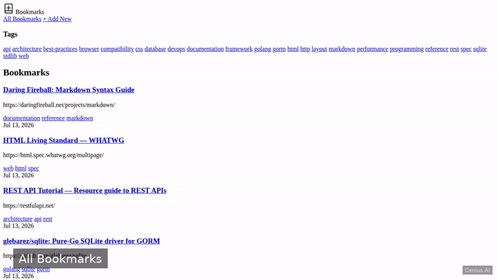
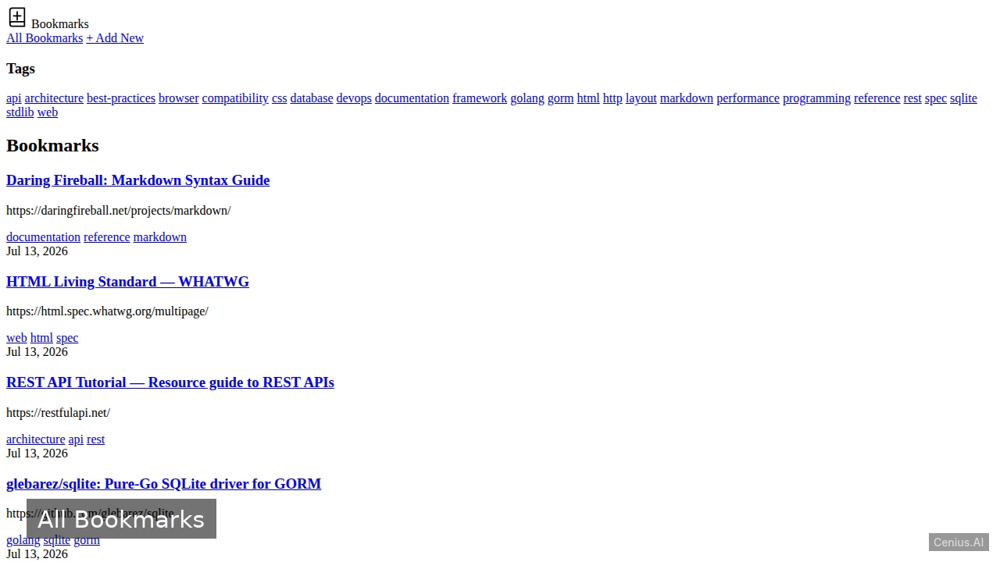
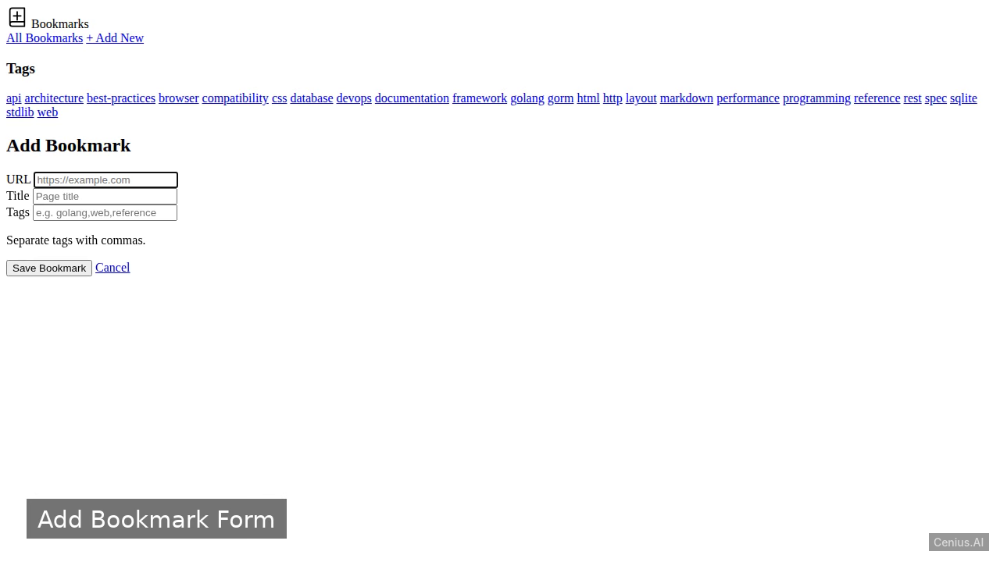

# Bookmark Manager — Go bookmark to-do list app reference implementation

**Bookmark Manager** is a free, open-source bookmark to-do list app written in Go. A web‑based bookmark manager built in Go using the Fiber v2 framework and a pure‑Go SQLite driver (GORM with glebarez/sqlite). Every Bookmark Manager file — code, design, seeded demo data — ships in this repository under the Apache-2.0 license. Self-host it, or [remix Bookmark Manager on cenius.ai](https://cenius.ai/marketplace/p/bookmark-manager-4?ref=gh&utm_campaign=bookmark-manager-golang) to get a custom build with full rebrand rights.


[](LICENSE)  [](https://cenius.ai)

[](https://cenius.ai/marketplace/p/bookmark-manager-4?ref=gh&utm_campaign=bookmark-manager-golang)

> **▶ [Open & edit in cenius.ai](https://cenius.ai/marketplace/p/bookmark-manager-4?ref=gh&utm_campaign=bookmark-manager-golang)** — one click to an editable workspace: describe changes in plain English, get an instant preview, one-click deploy and host. Modifications made on the platform come with full rebrand & relicense rights.

_Local clone? See [Quick start](#quick-start) below. cenius.ai is the zero-setup path._

## Demo



▶ **[Video walkthrough](https://cenius.ai/marketplace/p/bookmark-manager-4?ref=gh&utm_campaign=bookmark-manager-golang)** — see the app in action on the cenius.ai project page · [MP4 file](.github/media/demo.mp4)

## Screenshots

  

## Quick start

```bash
./install.sh   # installs dependencies + seeds demo data
```

See [`INSTALL.md`](INSTALL.md) for full setup and usage instructions.

## Features

- View All Bookmarks
- Add New Bookmark
- Tag Filtering

## Architecture

`install.sh` provisions dependencies and seeds demo data so the app starts with something real to explore. The Go codebase (40 files) is self-contained — no external services needed to evaluate it. Top-level layout: `database/`, `handlers/`, `models/`, `static/`, `templates/`. Step-by-step setup guide: [`INSTALL.md`](INSTALL.md).

## Usage guide

### Overview

Once the server is running (see [INSTALL.md](INSTALL.md)), open your browser at:

```
http://localhost:8080
```

### Home Page – Bookmark List

The home page (`/`) displays all bookmarks. Each bookmark shows its URL, title, and associated tags. If no bookmarks exist, a message is displayed.

#### Tag Filter

To view only bookmarks with a specific tag, append `?tag=<tagname>` to the URL. For example:

```
http://localhost:8080/?tag=dev
```

This will reload the list showing only bookmarks tagged with `dev`.

### Adding a Bookmark

Navigate to the add page:

```
http://localhost:8080/add
```

Fill in the form fields:

- **URL** (required) – the bookmark URL.
- **Title** (optional) – a descriptive title.
- **Tags** (optional) – comma-separated tags.

Click **Submit**. After successful creation, you are redirected back to the bookmark list.

### Example cURL Requests

Since the application returns HTML, you can fetch pages with `curl`:

```bash
## Get the bookmark list
curl http://localhost:8080/

## Get the add bookmark form
curl http://localhost:8080/add

## Filter by tag
curl http://localhost:8080/?tag=example
```

### Seed Data

On first start, if the bookmarks table is empty, several sample bookmarks are inserted automatically (see `database/seed.go`). This provides initial content for testing.

_Full guide: [`USAGE.md`](USAGE.md)_

## FAQ

### How do I get Bookmark Manager running locally?

Everything you need ships in this repo: clone it, run `./install.sh` to install dependencies and seed demo data, then follow [`INSTALL.md`](INSTALL.md) to start it. No external services required.

### What technologies are in Bookmark Manager's stack?

Go end-to-end. Every file you need to run the app is here in this repository — code, configuration, seed data. Highlights include tag Filtering.

### Is it possible to white-label Bookmark Manager for a client?

Yes. You can edit the source directly under the MIT license, or [remix it on cenius.ai](https://cenius.ai/marketplace/p/bookmark-manager-4?ref=gh&utm_campaign=bookmark-manager-golang) — the platform route grants full rebrand and relicense rights over your derivative.

### Can I use Bookmark Manager in a commercial project?

Yes. The code is Apache-2.0-licensed — use it, modify it, and ship it commercially. See [LICENSE](LICENSE).

### How can I customize Bookmark Manager without editing code?

Open it on [cenius.ai](https://cenius.ai/marketplace/p/bookmark-manager-4?ref=gh&utm_campaign=bookmark-manager-golang) and describe the changes you want in plain English — the platform modifies the app and gives you a new, downloadable build.

## License & rebranding

Released under the [Apache License 2.0](LICENSE) (© 2026 Cenius AI) — free for personal and commercial use. The Cenius name/logo are trademarks (see NOTICE).

**Need a customized version?** [Remix this app on cenius.ai](https://cenius.ai/marketplace/p/bookmark-manager-4?ref=gh&utm_campaign=bookmark-manager-golang) — modifications made on the platform come with **full rebrand & relicense rights** over your derivative.

## Built with cenius.ai

This entire application — code, design, seeded demo data — was generated on **[cenius.ai](https://cenius.ai)** from a plain-English description.

- 🚀 [Build your own app on cenius.ai](https://cenius.ai)
- 🎛️ [Remix Bookmark Manager on the marketplace](https://cenius.ai/marketplace/p/bookmark-manager-4?ref=gh&utm_campaign=bookmark-manager-golang) — open it in a workspace, prompt for changes, and ship your own version.

More open-source apps: [the Cenius-ai catalog](https://github.com/Cenius-ai) · [showcase index](https://github.com/Cenius-ai/showcase)
